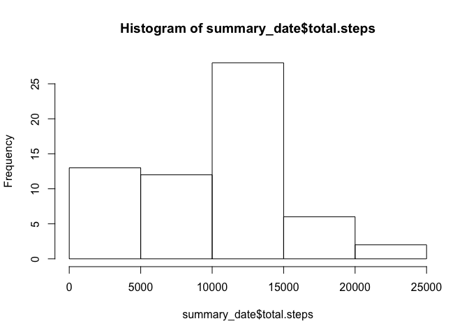
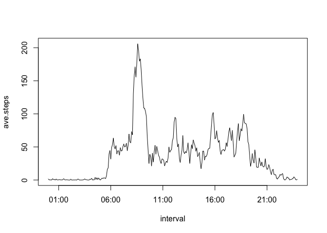
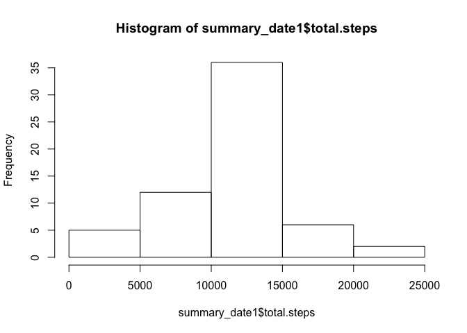
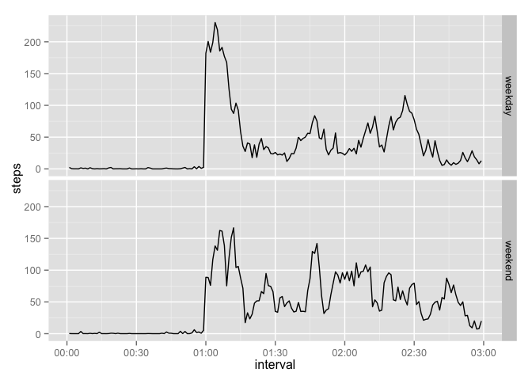

# Reproducible Research: Peer Assessment 1


## Loading R packages and set working directory

```r
library(dplyr)
```

```
## 
## Attaching package: 'dplyr'
## 
## The following object is masked from 'package:stats':
## 
##     filter
## 
## The following objects are masked from 'package:base':
## 
##     intersect, setdiff, setequal, union
```

```r
library(reshape2)
library(ggplot2)
setwd("~/Documents/coursera/Reproducible_research/assignment1/RepData_PeerAssessment1")
```


## Loading and preprocessing the data
We use the following code to unzip and read the csv data. Also we convert the column "date" to be date format.

```r
unzip("activity.zip")
activity <- read.csv("activity.csv")
activity$date <- as.Date(activity$date)
```
Next we summarize the data by dates and calculate the sum of steps for each date.

```r
days <- group_by(activity, date)
summary_date <- summarize(days, total.steps = sum(steps, na.rm = TRUE))
```
A histogram is plotted on the total number of steps taken per day.

```r
if (!file.exists("figure")){
        dir.create("figure")
        }
hist(summary_date$total.steps)
```

 

```r
dev.copy(png, file = "figure/plot1.png")
dev.off()
```


## What is mean total number of steps taken per day?
The mean and median total number of steps taken per day are calculated.

```r
mean(summary_date$total.steps, na.rm = TRUE)
```

```
## [1] 9354.23
```

```r
median(summary_date$total.steps, na.rm = TRUE)
```

```
## [1] 10395
```


## What is the average daily activity pattern?
This part summarize the data by intervals and calculated the mean steps taken for each interval. The intervals are converted to time format and the corresponding time series plot is made.

```r
intervals <- group_by(activity, interval)
summary_interval <- summarize(intervals, ave.steps = mean(steps, na.rm = TRUE))
summary_ts <- transform(summary_interval, interval = strptime(sprintf("%04d", interval), 
                                                           format = "%H%M"))
with(summary_ts, plot(interval, ave.steps, type = "l"))
```

 

```r
dev.copy(png, file = "figure/plot2.png")
dev.off()
```


## Imputing missing values
Here we first figure out the number of missing observations.

```r
sum(is.na(activity$steps))
```

```
## [1] 2304
```
We impute the missing value by replacing the NA's by the mean value for each interval which is calculated in the previous part.

```r
imputed <- transform(activity, interval = factor(interval))
summary_interval <- transform(summary_interval, interval = factor(interval))
for (i in levels(imputed$interval)){
        imputed[imputed$interval == i & is.na(imputed$steps), "steps"] <- 
                summary_interval[summary_interval$interval == i, "ave.steps"]
}
```
Now the missing values are imputed and we can verify as below.

```r
sum(is.na(imputed$steps))
```

```
## [1] 0
```
We then calulate the total steps taken with the imputed data. The corresponding histgram is plotted in the same manner.

```r
days1 <- group_by(imputed, date)
summary_date1 <- summarize(days1, total.steps = sum(steps, na.rm = TRUE))
hist(summary_date1$total.steps)
```

 

```r
dev.copy(png, file = "figure/plot3.png")
dev.off()
```
We figure out again the mean and median value of total steps taken per day.

```r
mean(summary_date1$total.steps)
```

```
## [1] 10766.19
```

```r
median(summary_date1$total.steps)
```

```
## [1] 10766.19
```
The result is different with the first part.


## Are there differences in activity patterns between weekdays and weekends?
We use the following codes to compare activity patterns betwenn weekdays and weekends. The panel plots are made to show the difference.

```r
weekdays <- ifelse(weekdays(imputed$date) %in% c("Saturday","Sunday"), "weekend", "weekday")
imputed <- mutate(imputed, weekdays = factor(weekdays))


melted <- melt(imputed, id.vars = c("weekdays","interval"), measure.vars = "steps")
summary <- dcast(melted, weekdays + interval ~ variable, fun.aggregate = mean)
summary$interval <- as.integer(summary$interval)
summary1 <- transform(summary, interval = strptime(sprintf("%04d", interval), 
                                                           format = "%H%M"))

qplot(interval, steps, data = summary1, geom = "line", facets = weekdays ~ .)
```

```
## Warning: Removed 109 rows containing missing values (geom_path).
```

```
## Warning: Removed 109 rows containing missing values (geom_path).
```

 

```r
dev.copy(png, file = "figure/plot4.png")
dev.off()
```
It shows that weekday data seems to have larger variation when compared to weekend data.
